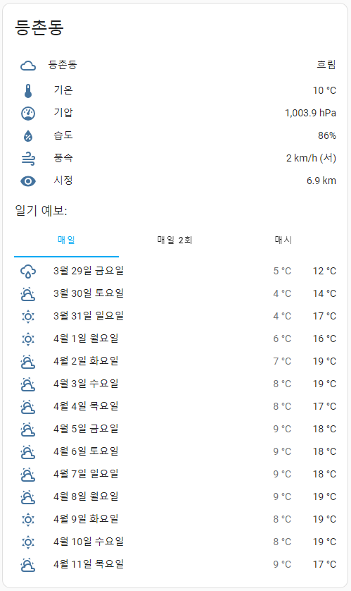

# 웨더뉴스 Weathernews
Home Assistant 커스텀 컴포넌트 for Weathernews 

weatherdotcom을 fork해 만들어졌습니다. [weatherdotcom integration by @jaydeethree](https://github.com/jaydeethree/Home-Assistant-weatherdotcom)

* **kr-weathernews.com 날씨 데이타를 사용합니다. 날씨 데이타 저작권은 모두 `Weathernews`에 있습니다**
* **개인(본인 또는 그 동거 가족)이 사적 이용 목적에 한해 사용가능합니다!**

-------------------

 
 

# 설치 구성요소
아래의 최소 요구 사항을 충족해야 설치 가능합니다. 

- Home Assistant 버전 2023.9 이상이 필요합니다

 
 

# 스크린샷

[Back to top](#top)

 
 

# 설치

HACS를 사용해 설치 합니다.

1. 통합구성요소 설치
   
   * 
   * HACS > Integretions > 우측상단 메뉴 > Custom repositories 선택 
      `https://github.com/dugurs/ha-weathernews` 주소 입력, Category에 'integration' 선택 후, 저장 
      HACS > Integretions > EXPLORE & DOWNLOAD REPOSITORIES > sesrch `웨더뉴스` > DOWNLOAD

2. 통합구성요서 설정추가
   
   * 
   * 설정 > 기기 및 서비 > 통합구성요소 추가하기 > `웨더뉴스 WeatherNews` 
      https://www.kr-weathernews.com/ 접속 > 도시검색 > 도시 선택 
      주소표시줄 ?region=XXXXXXXXXX의 XXXXXXXXXX 숫자를 "지역코드"에 넣기

[Back to top](#top)

 
 

# 생성되는 날씨 및 센서
날씨 엔터티는 `weather.wn_<LOCATION_NAME>`과 같이 생성되고 매일, 매일2외, 매시 가 예보됩니다. 

날씨 엔터티 외에도 이러한 추가 센서가 생성됩니다:
* `sensor.wn_<LOCATION_NAME>_current_condition` - 지금날씨
* `sensor.wn_<LOCATION_NAME>_day_condition` - 오전날씨
* `sensor.wn_<LOCATION_NAME>_night_condition` - 오후날씨
* `sensor.wn_<LOCATION_NAME>_dewpoint` - 이슬점
* `sensor.wn_<LOCATION_NAME>_heat_index` - 열 지수
* `sensor.wn_<LOCATION_NAME>_pressure` - 기압
* `sensor.wn_<LOCATION_NAME>_relative_humidity` - 습도
* `sensor.wn_<LOCATION_NAME>_temperature` - 온도
* `sensor.wn_<LOCATION_NAME>_temperature_feels_like` - 체감온도
* `sensor.wn_<LOCATION_NAME>_uv_index` - 자외선 지수 
* `sensor.wn_<LOCATION_NAME>_wind_direction_cardinal` - 풍향
* `sensor.wn_<LOCATION_NAME>_wind_gust` - 돌풍
* `sensor.wn_<LOCATION_NAME>_wind_speed` - 풍속
* `sensor.wn_<LOCATION_NAME>_sunrise` - 일출
* `sensor.wn_<LOCATION_NAME>_sunset` - 일몰
* `sensor.wn_<LOCATION_NAME>_pm10` - 미세먼지
* `sensor.wn_<LOCATION_NAME>_pm10_grade` - 미세먼지 등급
* `sensor.wn_<LOCATION_NAME>_pm25` - 초미세먼지
* `sensor.wn_<LOCATION_NAME>_pm25_grade` - 초미세먼지 등급
* `sensor.wn_<LOCATION_NAME>_day_short_comment` - 오늘 날씨 요약
* `sensor.wn_<LOCATION_NAME>_next_day_short_comment` - 내일 날씨 요약
* `sensor.wn_<LOCATION_NAME>_temp_diff_comment` - 어제와 기온차
* `sensor.wn_<LOCATION_NAME>_precipitation_probability` - 강수확률
* `sensor.wn_<LOCATION_NAME>_cai` - 통합대기등급
  * https://en.wikipedia.org/wiki/Heat_index
* `sensor.wn_<LOCATION_NAME>_weather_briefing` - 날씨보고
* `sensor.wn_<LOCATION_NAME>_precip_hour_today` - 오늘 비 예보
* `sensor.wn_<LOCATION_NAME>_precip_hour_today_tomarrow` - 오늘내일 비 예보
* `sensor.wn_<LOCATION_NAME>_precip_3hour` - 지금부터 3시간 비 예보
* `sensor.wn_<LOCATION_NAME>_precip_6hour` - 지금부터 6시간 비 예보
* `sensor.wn_<LOCATION_NAME>_precip_9hour` - 지금부터 9시간 비 예보
* `sensor.wn_<LOCATION_NAME>_precip_12hour` - 지금부터 12시간 비 예보
* 비 예보 공통 속성 (오늘, 오늘내일, 3시간, 6시간, 9시간, 12시간)
  * 'hour': '08', 시작시간
  * 'prec': 3, 시작시간의 강수량
  * 'pop': '80', 시작시간의 강수확률,
  * 'cmt': "13시 비", 요약
  * 'cmt2': '15시 까지 10mm', 요약2
  * 'hour_limit': 9, 예보기간
  * 'end_hour': '15', 첫 비 그치는 시간
  * 'end_sum_prec': 10, 첫 비 그치는 시간 까지 강수량
  * 'sum_prec': 12, 예보기간 동안의 총 강수량
  * 'max_pop': '80', 예보기간 중 최대 강수확률
  * 'snowrain': '비', 눈 비 구분

[Back to top](#top)

